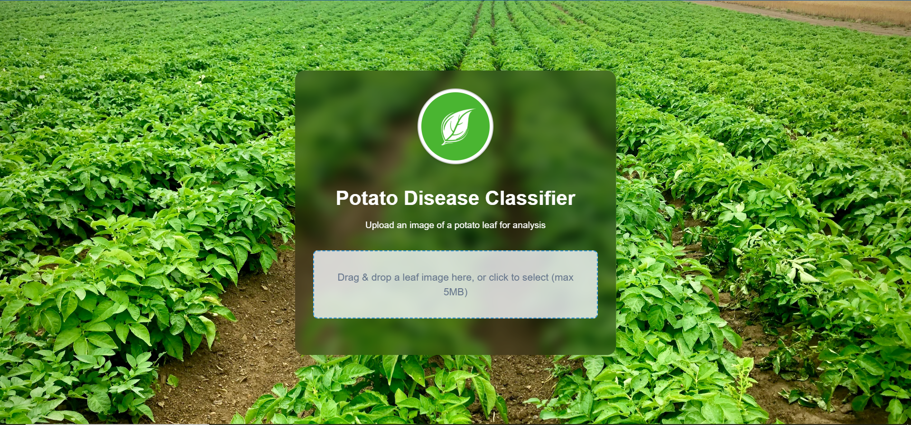
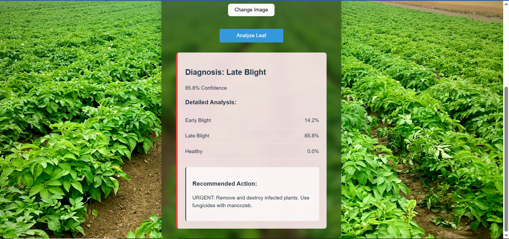

# 🥔 Potato Leaf Disease Classifier (React + FastAPI)

This project is a web-based AI tool that classifies potato leaf images into **Early Blight**, **Late Blight**, or **Healthy** using a machine learning model.

## 🚀 Features
- Upload and preview potato leaf images
- Classifies the image using a backend model
- Displays diagnosis, confidence level, and actionable advice
- Visualizes class probabilities with Chart.js

## 📦 Tech Stack
- Frontend: React, Chart.js, Dropzone
- Backend: FastAPI 
- Image upload and RESTful prediction endpoint

## 🖼️ UI Demo
* **Select Image**:

* **Image Selected**:

* **Result**:


## 🛠️ Setup Instructions

## 🚀 Getting Started

This project consists of a FastAPI backend serving a machine learning model and a React frontend interface for user interaction.

---

### 📦 Backend Setup (FastAPI)

1. **Navigate to the API directory**:

   ```bash
   cd api
   ```

2. **Create a virtual environment (optional but recommended)**:

   ```bash
   python -m venv venv
   source venv/bin/activate  # On Windows use `venv\Scripts\activate`
   ```

3. **Install dependencies**:

   ```bash
   pip install -r requirements.txt
   ```

4. **Run the API**:

   ```bash
   python main.py
   ```

5. **Test the API** by opening your browser or using a tool like `curl` or `Postman` and accessing:

   ```
   http://localhost:8000/ping
   ```

   You should receive the following response:

   ```json
   {
     "status": "alive",
     "message": "Model serving API is running"
   }
   ```

---

### 🌐 Frontend Setup (React)

1. **Go to the frontend directory** (if in root project folder):

   ```bash
   cd frontend
   ```

2. **Install frontend dependencies**:

   ```bash
   npm install
   ```

3. **Run the React app**:

   ```bash
   npm run dev
   ```

4. **Visit** `http://localhost:5173/` in your browser. You should see the homepage.

5. **Start testing** the app by uploading an image. The result will be displayed after the model processes the input.

---

### 🧠 Project Overview

This application allows users to upload images to a frontend interface. The images are then sent to a backend API where a machine learning model processes them and returns a prediction or analysis result. This result is then displayed on the frontend.

* **Backend**: Built with FastAPI, it hosts the ML model and handles requests.
* **Frontend**: Built with React, it provides an interactive UI for uploading images and viewing predictions.
* **Communication**: The frontend sends image data to the backend, receives the processed results, and presents them to the user.

---

### 📂 Directory Structure

```
project-root/
├── api/              # FastAPI backend
│   ├── main.py       # Entry point for the backend API
│   └── ...
├── frontend/         # React frontend app
│   ├── src/
│   └── ...
├── README.md
└── ...
```

